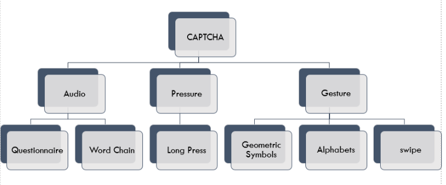

# 
 SIH 2020: Team Neoteric 

## Alternative Authentication Mechanism for Visually Impaired

### Ministry Category – DTE of IT and Cyber Security, DRDO 

### Problem Statement – CAPTCHA / Alternative Solution for Visually impaired 

### Problem Code – CK146

### Introduction: 
< Basic Introduction>
We are team Neoteric from College of engineering Pune and our problem statement is to propose alternative authentication mechanisms for visually impaired users.

### Defects with Current Captcha:
* Difficulty in figuring out letters and words, for the visually impaired and dyslexic
* Difficulty in understanding the audio due to accents, and similar background noise 

### Types of Captcha:

#### Questionnaire:

< image >
< what it is >
< which problem it solves and how it solves the problem >

#### Word Chain:

< image >
< what it is >
< which problem it solves and how it solves the problem >

#### Pressure:

< image >
< what it is >
< which problem it solves and how it solves the problem >

Currently, only long press pressure detection has been implemented, we plan to implement short press detection.
​

#### Symbol Recognition:

< image >
< what it is >
< which problem it solves and how it solves the problem >

#### Character Recognition:

< image >
< what it is >
< which problem it solves and how it solves the problem >

#### Motion Recognition - Swipe:

< image >
< what it is >
< which problem it solves and how it solves the problem >

### Highlights of Our Solution

< image >

#### Targetted Users
* Visually impaired
* Colour Blind
* Dyslexic
* Completely Blind
* Regular Users 

#### Contributors:

### Code Structure:
/assets - contains assets of required for the project like fonts, audio, backgrounds etc

/backend - Contains the PHP and Python Backend Code

/audio_operation - php files for operations on the audio like getting the audio, translating the audio

/image_operation - php files for operations on the captch images like displaying the image, formatting the image. 

/validation - php files for validating the captcha. Files named as (captchaNomenclatureName)_(whatThisFileDoes).php

/captcha_pages - different php files which contain the pages for displaying the various captcha types. Files named as (captchaNomenclatureName).php

/examples - examples to view how the captchas work and look
